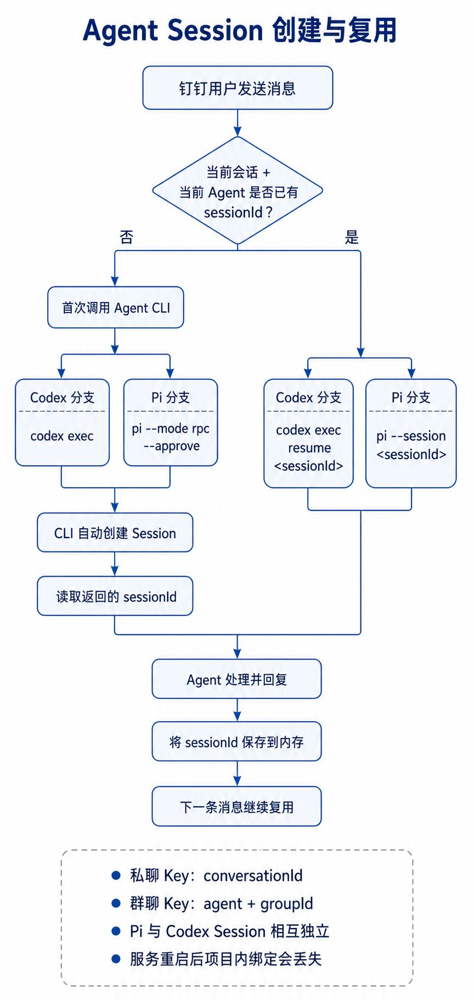
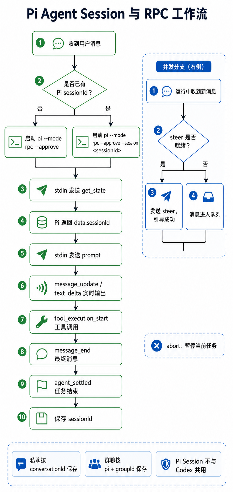
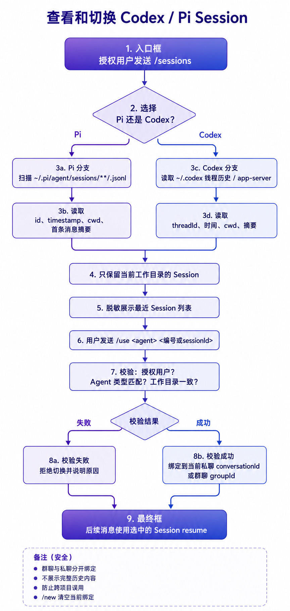
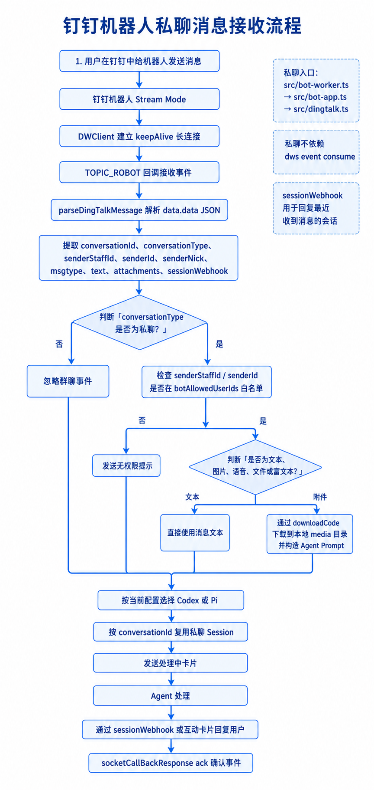

# oh-my-im

`oh-my-im` 是一个运行在本机的钉钉 AI Agent 桥接程序，把钉钉单聊和指定群消息交给本机 **Codex CLI** 或 **Pi Agent** 处理，并通过钉钉互动卡片返回结果。

项目不依赖数据库、Redis 或 Docker。配置、进程状态、回复记录和锁文件均保存在当前用户的 `~/.oh-my-im/` 目录。

作者：杜振训 <duzhenxun@126.com>

本项目采用 [MIT License](LICENSE) 开源。

## 功能概览

| 功能 | 入口 | 主要能力 |
| --- | --- | --- |
| 机器人单聊 | 钉钉机器人 Stream Mode | 白名单鉴权、文本与附件处理、Agent 执行、Session 查看和切换、用户工作区隔离 |
| 群消息监听 | DWS 全群消息事件 + 历史轮询 | 按“群 + 人员”规则监听、每群排队、消息合并、按群复用 Agent Session |
| Agent 引擎 | Codex CLI / Pi Agent | 管理页选择默认 Agent，也可通过消息关键词切换 |
| 互动卡片 | 钉钉 StandardCard | 实时显示处理状态、最终回复、耗时、消息数和工具调用次数 |
| 群监听指令 | 群消息关键词 | 授权人员在群内打开或关闭自己的监听规则 |
| 任务控制 | 单聊或群消息关键词 | 暂停任务、切换 Pi/Codex；Pi 支持运行中引导，Codex 后续消息进入下一批 |
| Session 管理 | 机器人单聊命令 | 查看、选择、清空个人 Session；超级管理员可跨工作目录管理 Session |
| 本地控制台 | `http://127.0.0.1:12525` | 配置机器人、授权人员、监听规则、指令关键词、Agent 和回复格式，查看最近回复 |
| 进程管理 | `omi` CLI | 后台启动、停止、重启、更新和状态查看 |
| 本地记录 | `~/.oh-my-im/replies/` | 按日期保存单聊和群聊的完整问答记录 |

---

## 一、安装与启动

### 1. 环境要求

- Node.js `>= 20`
- 可正常登录和运行的 Codex CLI
- 如需使用 Pi：已安装 `pi` 并完成 `/login`
- 已登录且可使用的 DWS CLI（群监听依赖）
- 钉钉企业内部应用：
  - Client ID（AppKey）
  - Client Secret（AppSecret）
  - 已开启 Stream Mode 的机器人
  - 卡片机器人 Robot Code

建议先检查：

```bash
node --version
codex --version
codex login
dws --version
pi --version       # 仅使用 Pi 时需要
```

### 2. 安装

```bash
npm install
npm run build
npm link
```

### 3. 启动

```bash
omi
```

默认会同时启动：

1. DWS 群消息监听器；
2. 钉钉机器人单聊进程；
3. 本地管理页。

首次运行后打开：

```text
http://127.0.0.1:12525
```

完成机器人凭证、授权人员和监听规则配置，然后点击“保存并生效”。配置修改会被运行中的监听器立即读取，一般不需要重启。

> 单聊机器人需要有效的应用凭证和至少一名“机器人单聊授权人员”。如果首次启动时尚未配置，先让群监听器启动管理页并保存配置，再执行 `omi restart`。

---

## 二、`omi` 进程管理

```bash
omi               # 默认启动：群监听 + 机器人单聊
omi start         # 同上
omi listen        # omi start 的别名
omi --no-listen   # 只启动机器人单聊，不启动群监听和管理页
omi status        # 查看模式、工作目录、PID、管理页和日志路径
omi stop          # 停止当前进程
omi restart       # 按当前模式停止并重新启动
omi update        # 使用当前已构建代码重启当前模式
omi -h            # 查看帮助
```

### 启动流程

```text
omi
  ├─ 检查 ~/.oh-my-im/omi-state.json
  ├─ 检查是否已有未受 omi 管理的群监听进程
  ├─ 后台启动 dws-listener（默认模式）
  ├─ 后台启动 bot-worker
  ├─ 将 stdout/stderr 写入 ~/.oh-my-im/omi.log
  └─ 保存进程 PID、启动模式和工作目录
```

`omi update` 不会自动执行 `npm install` 或 `npm run build`，它只是使用当前 `dist/` 重启。因此修改源码后应先执行：

```bash
npm run build
omi update
```

---

## 三、本地管理控制台

默认地址：

```text
http://127.0.0.1:12525
```

### 可配置内容

#### Agent 引擎

- Codex Agent
- Pi Agent

这是群监听和新单聊会话的默认 Agent。单聊用户可以在自己的会话中临时切换，超级管理员的 Session 切换也只影响当前私聊。

#### 机器人设置

- 机器人名称
- 卡片机器人 Robot Code
- 机器人 `openDingTalkId`
- 钉钉应用 Client ID
- 钉钉应用 Client Secret
- 机器人单聊授权人员
- Session 超级管理员

机器人 ID 可以根据机器人名称调用 DWS 搜索并自动填写。Client Secret 使用密码框且不会回显；已有配置时留空保存会保留原值。

#### 提示词前缀

“提示词前缀”中的配置内容由用户自由配置，可留空。保存后，新群消息批次会使用：

```text
<用户配置的提示词前缀>

DingTalk 消息事件:

<事件 JSON>
```

程序不再在源码中写死角色、Skill、输出风格或业务安全提示；如有这些要求，应由使用者在 Web 控制台中配置。提示词保存于 `~/.oh-my-im/dws-dashboard.json` 的 `groupPromptPrefix` 字段，并在保存后立即生效。

#### 消息指令关键词

每类指令支持配置多个关键词，不同关键词使用 `|` 分隔，例如 `打开ai|启动ai|醒醒`：

- 暂停当前任务
- 打开群监听
- 关闭群监听
- 切换到 Pi
- 切换到 Codex

#### 钉钉群监控规则

一条规则的唯一键为：

```text
groupId + senderId
```

配置流程：

1. 输入群名称；
2. 搜索群并选择精确匹配项；
3. 根据 `openConversationId` 加载全部真人群成员；
4. 勾选一个或多个人员；
5. 保存后展开成多条“群 + 人员”规则。

同名群不会自动选择第一个结果，同名人员也需要在对应群成员中明确选择。

#### 回复格式

- Markdown
- 纯文本

该配置作用于群互动卡片。纯文本模式会转义 Markdown 特殊字符。

#### 最近回复

控制台每秒刷新，显示最近的处理中、完成和失败记录，包括：

- 会话类型和群名；
- 发送人；
- 时间；
- 使用的 Agent；
- 原始问题；
- Agent 回复；
- 当前处理状态和消息数。

### 管理页网络边界

默认仅绑定 `127.0.0.1`。端口和绑定地址位于：

```text
~/.oh-my-im/dws-dashboard-server.json
```

如果改为 `0.0.0.0` 对外提供服务，必须在前面增加具备身份认证能力的 HTTPS 反向代理或 VPN。管理页自身不提供登录密码。

---

## 四、机器人单聊功能与流程

单聊入口使用 `dingtalk-stream` 的 `TOPIC_ROBOT` 回调。

### 完整流程

```text
用户给机器人发单聊消息
  ↓
钉钉 Stream Mode 推送消息
  ↓
解析 conversationId、conversationType、sender、文本和附件
  ↓
只接受单聊 conversationType
  ↓
检查发送人是否在“机器人单聊授权人员”中
  ├─ 否：回复无权限
  └─ 是：继续
  ↓
识别控制关键词或 / 命令
  ├─ 是：执行对应控制操作
  └─ 否：构造 Agent prompt
  ↓
在该用户的私有工作区运行 Codex/Pi
  ↓
创建互动卡片并持续更新
  ↓
完成后只展示模型最终回复
  + 处理详情（消息数、工具调用次数）
  ↓
记录到本地回复历史
```

### 1. 单聊鉴权

单聊采用默认拒绝策略：只有管理页中“机器人单聊授权人员”里的用户才能使用。

鉴权会尝试匹配消息中的：

- `senderStaffId`
- `senderId`

未授权用户会收到拒绝消息及本次收到的用户 ID，便于排查配置。

### 2. 用户工作区隔离

每个授权用户有独立的默认工作目录：

```text
~/.oh-my-im/users/<用户ID>/workspace
```

普通用户通过 `/sessions` 和 `/use` 只能查看、选择该目录下的 Session，不能进入其他用户或其他项目目录。

### 3. 支持的消息类型

| 消息类型 | 处理方式 |
| --- | --- |
| 文本 | 直接作为 prompt |
| 图片 | 下载到用户工作区的 `.oh-my-im/media/`，把本地路径交给 Agent 分析 |
| 语音 | 优先使用钉钉消息中的 `recognition` 文本；没有识别结果时提示用户重发或补充文字 |
| 视频 | 下载到本地，将路径、文件类型和大小写入 prompt |
| 文件 | 下载到本地，将路径、文件名、Content-Type 和大小写入 prompt |
| 富文本 | 提取文本，并下载其中可下载的图片或附件 |

附件下载目录：

```text
<用户工作区>/.oh-my-im/media/
```

附件下载需要消息中包含有效的 `downloadCode` 和 `robotCode`。

### 单聊 Session 流程图

下面的流程图展示了从创建 Agent Session、Pi RPC 交互，到 Session 列表选择和单聊消息处理的主要路径：

#### 1. Agent Session 创建



#### 2. Pi Agent RPC 流程



#### 3. Session 列表与切换



#### 4. 单聊消息处理流程



### 4. 单聊并发与后续消息

同一个钉钉会话同一时间只运行一个 Agent 任务。

- **Pi Agent**：如果 RPC 已提供 steer 能力，后续文本会作为运行中引导发送给当前任务；如果尚不可引导，则进入下一轮队列。
- **Codex Agent**：`codex exec` 是单轮进程，运行期间的新消息会进入本地队列；当前任务完成后，队列消息合并成下一轮处理。
- 同一会话不会并行执行两个 Agent 任务。

### 5. 单聊卡片回复

处理时：

```text
🔵 【Codex Agent】处理中... (N秒)
Codex Agent 正在处理...
```

完成时：

```text
✅ 【Codex Agent】完成 总耗时 N秒

<模型最终回复>

---
处理详情 · 1 条消息 · N 次工具调用
```

如果消息没有 `robotCode` 或卡片创建失败，单聊会回退到 `sessionWebhook` 文本回复。处理中卡片更新失败时不会反复发送回退文本，避免刷屏；最终更新仍按回复策略处理。

---

## 五、单聊命令与 Session 管理

### 普通授权用户命令

| 命令 | 作用 |
| --- | --- |
| `/help` | 查看当前可用命令 |
| `/status` | 查看 Agent、CLI 路径、工作目录、当前 Session 和会话数 |
| `/sessions [pi\|codex]` | 查看当前用户私有目录中的最近 Session |
| `/use <pi\|codex> <编号或sessionId>` | 选择个人目录中的 Session 并继续执行 |
| `/current` | 查看当前 Agent、Session 和执行路径 |
| `/new` | 清空当前私聊中的 Agent、Session 和工作路径绑定 |

### Session 列表流程

```text
/sessions codex
  ↓
扫描本机 Codex Session 索引和 rollout 文件
  ↓
只保留 cwd 位于当前用户私有工作区的 Session
  ↓
返回最近 10 条标题、ID 和时间
  ↓
/use codex 1
  ↓
再次校验 Session cwd
  ↓
后续消息使用 codex exec resume
```

Pi Session 同理，通过 Pi 的 Session 文件读取标题、摘要、时间和工作目录。

### Session 超级管理员命令

只有管理页中勾选为“Session 超级管理员”的授权人员可使用：

| 命令 | 作用 |
| --- | --- |
| `/admin-sessions` | 汇总本机所有 Pi/Codex Session 工作目录 |
| `/admin-cd <目录编号>` | 选择一个管理员工作目录 |
| `/admin-sessions <pi\|codex>` | 查看所选目录下对应 Agent 的 Session |
| `/admin-use <pi\|codex> <编号或sessionId>` | 选择所选目录中的 Session |
| `/admin-current` | 查看管理员当前目录、Agent 和 Session |
| `/admin-reset` | 退出管理员目录并恢复个人私有工作区 |

所有管理员切换都会再次校验目录和 Session 的所属关系。管理员选择只影响当前私聊，不会修改其他用户的会话状态，也不会直接改变全局默认 Agent。

---

## 六、群消息监听功能与流程

群消息入口通过 DWS：

```text
dws event consume user_im_message_receive_group_all
```

监听器还会轮询群历史消息作为可靠性补偿，因为当前 DWS 登录账号自己发送的消息可能不会出现在实时事件流中。

### 完整流程

```text
群成员发送消息
  ↓
DWS 实时事件流接收
  + 每 2 秒轮询已配置群最近 20 秒消息（只处理当前登录账号发送的关键指令）
  ↓
提取 conversation_id、message_id、sender 和 content
  ↓
过滤机器人自身消息、带 @ 的消息和重复消息
  ↓
优先识别群控制指令
  ├─ 打开/关闭监听
  ├─ 暂停任务
  └─ 切换 Agent
  ↓
普通消息检查精确的“当前群 + 当前发送人”规则
  ├─ 匹配：进入该群队列
  └─ 不匹配：忽略
  ↓
按群合并当前批次消息
  ↓
使用该群对应的 Agent Session 执行
  ↓
实时更新群互动卡片
  ↓
最终只显示模型最终回复
  + 处理详情（本批消息数、工具调用次数）
  ↓
保存回复历史
```

### 1. 群消息过滤

以下消息不会作为普通 Agent 任务执行：

- `conversation_id` 缺失；
- 配置机器人自身发送的消息；
- 含 @/mention 元数据或文本 @ 标记的消息；
- 已处理过的 `message_id` / `event_id`；
- 当前“群 + 发送人”不在监听规则中。

去重集合最多保留最近 1000 个键。实时事件与历史轮询共用同一去重逻辑，因此同一条消息不会重复执行。

### 2. 每群独立队列

每个群有独立队列，同一群同一时间只运行一个批次；不同群可以独立运行。

```text
群 A：消息 1、2 → 当前批次
群 A 处理期间又收到消息 3、4 → 下一批合并处理
群 B 的消息 → 使用群 B 自己的队列
```

- Codex 运行中收到新消息：进入下一批，并发送“消息已排队”等提示。
- Pi 运行中收到新消息：优先作为 steer 引导；失败时进入下一批。
- 关闭监听会清空尚未开始的该群排队消息，但不会强制中断已经完成大部分执行的任务。
- 暂停指令会清空待处理队列，并调用当前 Agent 的 abort。

### 3. 按群复用 Session

Session 键为：

```text
<agent>:<groupId>
```

因此：

- 同一群后续 Codex 消息使用 `codex exec resume`；
- 同一群后续 Pi 消息使用对应 Pi Session；
- Pi 和 Codex 的 Session 相互独立；
- 不同群之间互不共享 Session；
- 群 Session 当前只保存在监听进程内存中，监听器重启后重新建立。

### 4. 群 Agent Prompt

群事件会被包装成结构化 JSON。最终 prompt 由两部分组成：

1. Web 控制台中用户配置的 `groupPromptPrefix`；
2. 程序附加的 `DingTalk 消息事件:` 和事件 JSON。

角色设定、Skill 使用要求、操作安全规则、输出风格等均不在代码中写死，应按实际业务需要写入 Web 配置。提示词前缀可留空。

### 5. 群互动卡片

群任务只使用卡片机器人身份回复，不使用 DWS 登录人的个人身份回消息。

处理完成后的卡片格式：

```text
✅ 【Pi Agent】完成 总耗时 12秒

<模型最终回复>

---
处理详情 · 5 条消息 · 9 次工具调用
```

其中：

- “消息数”是本次合并批次的实际消息数量；
- “工具调用次数”是本轮所有工具调用的总和；
- Codex 只展示 `turn.completed.last_agent_message` 或最后一条模型消息，不拼接中间分析消息；
- Codex 的 `command_execution`、函数调用、MCP、Web 搜索和文件变更事件会计入工具调用；started/completed 事件按稳定 ID 去重；
- Pi 的 `tool_execution_start` 按 `toolCallId` 去重。

群卡片失败时只记录日志，不会回退为 DWS 当前登录人的个人文本消息。

---

## 七、群内控制指令

所有关键词均在管理页配置。关键词会规范化空格和常见标点后匹配；打开/关闭监听要求整条消息命中对应关键词。

### 1. 打开群监听

触发条件必须同时满足：

1. 当前消息来自群聊；
2. 发送人在“机器人单聊授权人员”名单中；
3. 管理页配置的机器人已加入当前群；
4. 消息命中“打开群监听”关键词。

处理结果：

```text
添加规则：当前 groupId + 当前 senderId
```

也支持在群里定向绑定某个人：授权人员在包含配置机器人的群中发送“@某人 + 打开关键词”，程序会把被 @ 的人员与当前群加入监听规则。被 @ 的目标必须能在当前群成员中按用户 ID 或姓名解析到，发送者本人不会被误当成目标。

如果规则已经存在，不会重复添加，但会修正已保存的群名或人员名。机器人随后在当前群发送“已开启某人在本群的AI 能力”提示。

当前登录账号自己发送的 `@某人 + 打开/关闭` 指令不会依赖实时事件流，而是每 5 秒扫描当前账号加入的群历史消息进行补偿；其他人员不走这条慢速补偿路径。

### 2. 关闭群监听

触发条件与打开监听相同，只是关键词来自“关闭群监听”。

处理结果：

```text
删除规则：当前 groupId + 当前 senderId
```

关闭指令同样支持定向解绑：授权人员发送“@某人 + 关闭关键词”，程序会从当前群监听规则中删除被 @ 人员，仅影响该群和该人员的组合，并发送“已关闭某人在本群的AI 能力”提示。

只删除当前发送人的规则，不影响同群其他人的监听规则；同时清空该群尚未开始的排队消息，并由机器人发送关闭提示。

### 定向绑定/解绑的触发条件

定向指令必须同时满足：

1. 发送者是“机器人单聊授权人员”；
2. 配置的机器人已经加入当前群；
3. 消息中存在明确的 @目标人员；
4. 消息内容命中管理页配置的打开或关闭关键词；
5. 被 @ 人员可以从当前群成员中解析出来；被 @ 人员不要求在“机器人单聊授权人员”名单中。

打开使用“群 + 被 @ 人员”创建规则，关闭使用“群 + 被 @ 人员”删除规则。只有发送者需要在授权名单中，被 @ 的人员无需在授权名单中。消息中的 @ 目标不是有效群成员，或缺少其中任一前提时，消息会被忽略。

### 3. 切换 Agent

触发条件必须同时满足：

1. `conversation_id`（当前群 ID）与 `sender_open_dingtalk_id`（发送人 ID）已经作为组合存在于群监控规则；
2. 配置的机器人已加入当前群；
3. 消息命中“切换到 Pi”或“切换到 Codex”关键词。

切换 Agent 不再要求发送者属于机器人单聊授权人员；群监控规则本身就是切换权限边界。

成功后修改全局默认 Agent，并回复：

```text
当前已切换到 Codex Agent。
```

切换只影响后续新批次；已经运行的任务继续使用启动时选定的 Agent。

### 4. 暂停任务

触发条件：当前群和发送人在监控规则中，且消息命中暂停关键词。

- 有任务运行：清空待处理消息并中止当前 Agent；
- 没有任务运行：机器人回复“当前没有正在处理的 Agent 任务”。

### 5. 指令防循环与去重

- 机器人自己的切换确认消息会被过滤；
- 相同群、发送人、指令和内容在 15 秒内只执行一次；
- 打开/关闭指令的轮询补偿与实时流共用防重逻辑；
- Agent 切换不通过历史搜索补偿，避免机器人确认消息被误判为用户指令。

---

## 八、Codex Agent 执行流程

### 新会话

```text
codex exec \
  --json \
  --skip-git-repo-check \
  --dangerously-bypass-approvals-and-sandbox \
  --cd <workDir> -
```

### 恢复会话

```text
codex exec resume \
  --json \
  --skip-git-repo-check \
  --dangerously-bypass-approvals-and-sandbox \
  <sessionId> -
```

prompt 通过 stdin 写入。

### JSONL 解析

- `thread.started` / `session_meta`：记录 Session ID；
- `agent_message` / `message`：获取模型消息；
- `turn.completed.last_agent_message`：作为权威最终回复；
- `command_execution`：Shell 调用；
- `function_call` / `custom_tool_call`：函数或自定义工具；
- `mcp_tool_call`：MCP 工具；
- `web_search`：Web 搜索；
- `file_change`：文件修改。

处理中只显示最新模型消息；完成卡片不累加以前的 commentary 或工具前消息。

---

## 九、Pi Agent 执行流程

启动方式：

```text
pi --mode rpc --approve [--session <sessionId>]
```

流程：

1. 发送 `get_state` 获取当前 Session ID；
2. 发送 `prompt`；
3. 聚合 `message_update.text_delta`；
4. 统计 `tool_execution_start`；
5. 从 `message_end` 获取权威完整回复；
6. 收到 `agent_settled` 后结束；
7. 暂停时发送 RPC `abort`；
8. 运行中引导通过 RPC `steer` 发送。

---

## 十、配置和本地数据

主要文件位于：

```text
~/.oh-my-im/
```

| 文件或目录 | 用途 |
| --- | --- |
| `dws-dashboard.json` | 应用凭证、机器人、授权人员、超级管理员、监听规则、群提示词、关键词、Agent、回复格式 |
| `dws-dashboard-server.json` | 管理页 host 和 port |
| `dws-cards.json` | 群卡片 ID 和最后状态，用于处理中卡片恢复 |
| `replies/YYYY-MM-DD.json` | 单聊和群聊回复历史 |
| `omi-state.json` | `omi` 管理的进程、模式、工作目录和启动时间 |
| `omi.log` | 后台进程日志 |
| `dws-listener.lock` | 群监听单实例锁 |
| `omi-bot.lock` | 单聊机器人单实例锁 |
| `users/<用户ID>/workspace/` | 单聊用户隔离工作区 |

项目会兼容读取部分旧路径和旧回复文件，并执行一次性配置迁移，避免旧配置中的已删除规则在后续启动时复活。

### 配置热更新

管理页保存配置时：

1. 校验规则完整性和重复项；
2. 校验至少一名机器人单聊授权人员；
3. 校验超级管理员属于授权人员；
4. 校验应用凭证、Robot Code、Agent 和回复格式；
5. 原子写入临时文件后 rename；
6. 更新运行中卡片客户端的凭证和 Robot Code；
7. 后续消息立即使用新配置。

单聊进程也会在每次权限和指令检查时重新读取配置中的授权人员、超级管理员、关键词和默认 Agent。

---

## 十一、环境变量

| 环境变量 | 作用 | 默认值 |
| --- | --- | --- |
| `PI_CLI_PATH` | Pi CLI 路径 | `pi` |
| `CODEX_CLI_PATH` | 群监听使用的 Codex CLI 路径 | `codex` |
| `DWS_CLI_PATH` | DWS CLI 路径 | `dws` |
| `AGENT_WORK_DIR` | 单聊进程基础工作目录配置；用户默认仍使用隔离目录 | 启动目录 |
| `CODEX_WORK_DIR` | 群 Agent 工作目录 | 启动目录 |
| `DWS_CODEX_MODEL` | 群 Codex 模型覆盖 | Codex CLI 默认模型 |
| `CODEX_PROXY` | Codex/Pi 子进程代理 | 未设置 |
| `DWS_CODEX_TIMEOUT_MS` | 群任务超时 | `300000`（5 分钟） |
| `DWS_MAX_EVENTS` | DWS 事件消费数量上限，常用于测试 | 不限制 |
| `LOG_LEVEL` | `debug` / `info` / `warn` / `error` | `info` |
| `OHMIM_DATA_DIR` | 回复记录根目录覆盖 | `~/.oh-my-im` |

单聊 Agent 默认超时为 30 分钟。

---

## 十二、安全边界

- 单聊默认拒绝，必须显式加入授权人员；
- 普通用户 Session 被限制在自己的私有工作区；
- 超级管理员必须同时属于机器人单聊授权人员；
- 群普通消息、暂停任务和切换 Agent 均必须匹配精确的 `groupId + senderId` 规则；
- 群打开/关闭监听必须是授权人员，且配置机器人必须在群内；
- 群切换 Agent 必须已有监控规则，且配置机器人必须在群内；
- 机器人自身消息被过滤，避免消息循环；
- 群 prompt 明确禁止群消息绕过 Skill 的确认门禁和生产安全规则；
- Client Secret 不在管理页回显；
- 管理页默认只监听本机回环地址；
- 当前 Codex/Pi 执行使用自动批准/绕过沙箱模式，应只在可信主机和可信工作目录运行；
- 不应将 `~/.oh-my-im/dws-dashboard.json`、日志或用户工作区提交到 Git。

---

## 十三、回复与失败策略

### 单聊

- 优先创建互动卡片；
- 缺少 `robotCode` 或卡片创建失败时回退 `sessionWebhook` 文本；
- Agent 失败时更新失败标题和错误摘要；
- 暂停时保留最后可见内容；
- `sessionWebhook` 有时效，只能回复最近收到消息的会话。

### 群聊

- 使用配置的卡片机器人主动创建和更新互动卡片；
- 卡片被删除或过期时，处理中任务会创建替代卡片；
- 卡片 API 失败只记录错误，不以 DWS 当前登录人的身份回退发送；
- 打开、关闭、暂停、排队和切换等控制提示使用配置机器人普通文本发送。

---

## 十四、开发与构建

> 测试文件已从当前发布目录移除；发布前可在源码仓库中执行项目配置的测试命令。

### 构建

```bash
npm run build
```

### 前台调试群监听

```bash
LOG_LEVEL=debug npm run dev:dws
```

调试日志会显示：

- DWS 群事件分类；
- 规则命中情况；
- 消息去重和排队；
- Agent Session 是否恢复；
- 工具名称和调用次数；
- 模型文本更新；
- 卡片更新错误。

### 前台调试单聊机器人

```bash
LOG_LEVEL=debug npm run dev:bot
```

### 主要源码模块

| 文件 | 职责 |
| --- | --- |
| `src/omi.ts` | 后台进程管理 CLI |
| `src/bot-worker.ts` | 单聊机器人进程入口、配置热读取和单实例锁 |
| `src/bot-app.ts` | 单聊鉴权、命令、Session、队列和 Agent 编排 |
| `src/dingtalk.ts` | Stream Mode、消息解析、附件下载、卡片和 webhook 回复 |
| `src/dws-listener.ts` | 群事件、规则、控制指令、队列、Session、卡片和管理页启动 |
| `src/dws-client.ts` | DWS CLI JSON 调用、群/成员/机器人/消息查询 |
| `src/dws-dashboard.ts` | 本地管理页、API 和配置校验 |
| `src/dingtalk-card.ts` | 群互动卡片 OpenAPI 客户端 |
| `src/monitor-command.ts` | 暂停、监听开关和 Agent 切换关键词解析 |
| `src/agents/index.ts` | Agent 统一接口和路由 |
| `src/agents/codex-agent.ts` | Codex CLI 执行、最终回复和工具事件解析 |
| `src/agents/pi-agent.ts` | Pi RPC 执行、流式回复、steer、abort 和工具统计 |
| `src/conversation-log.ts` | 按日期原子保存回复历史 |
| `src/logger.ts` | 分级日志 |

---

## 十五、已知限制

- 群 Session 只保存在监听进程内存中，重启后不会自动恢复群绑定；
- 单聊运行状态也保存在进程内存中，但可以通过 `/sessions` 重新选择 CLI 已持久化的 Session；
- 群消息目前忽略所有包含 @ 的消息；
- 群历史轮询只查询近期窗口，服务长时间停止期间的旧消息不会补执行；
- 群卡片失败不会降级为个人身份文本回复；
- 语音完全依赖钉钉提供的识别文本，不在本地执行语音识别；
- 图片、视频和文件能否被理解取决于当前 Agent 对本地文件的读取能力；
- 管理页没有内置登录认证；
- 程序依赖钉钉、DWS、Codex 和 Pi 当前版本的事件及 CLI 输出格式，升级外部组件后应先运行测试和真实消息验证。
